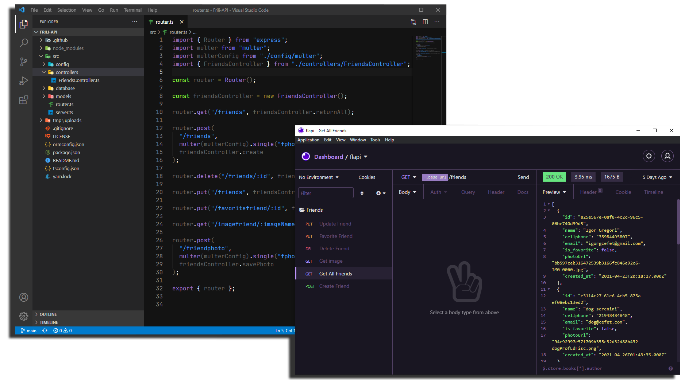
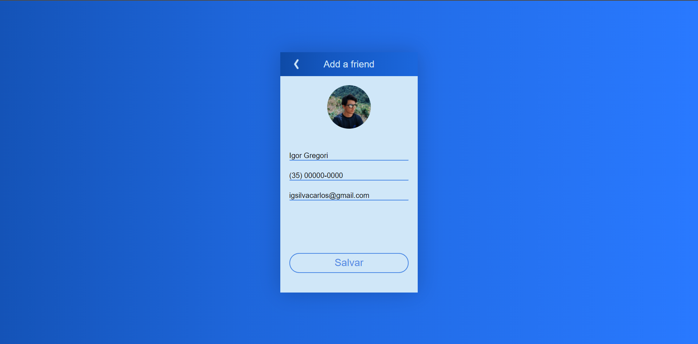

<h1 align="center">:ok_woman: API - FRILI :heavy_check_mark:</h1>

<p align="center">
 <a href="https://www.linkedin.com/in/igor-gregori/">
    
  </a>
  <a href="https://github.com/Igor-Gregori/Frili-API/blob/main/LICENSE">
    
  </a>
  <a href="https://github.com/Igor-Gregori/Frili-API/issues">
    
  </a>
  <a href="https://github.com/Igor-Gregori/Frili-API/issues?q=is%3Aissue+is%3Aclosed">
    
  </a>
  <a href="https://github.com/Igor-Gregori/Frili-API/stargazers">
    
  </a>
  <a href="https://github.com/Igor-Gregori/Frili-API/network">
    
  </a>
</p>

<p align="center">
  <a href="#page_facing_up-descrição">Descrição</a>&nbsp;&nbsp;&nbsp;|&nbsp;&nbsp;&nbsp;
  <a href="#-tecnologias">Tecnologias</a>&nbsp;&nbsp;&nbsp;|&nbsp;&nbsp;&nbsp;
  <a href="#computer-instalação">Instalação</a>&nbsp;&nbsp;&nbsp;|&nbsp;&nbsp;&nbsp;
  <a href="#man-Desenvolvedor">Desenvolvedor</a>&nbsp;&nbsp;&nbsp;|&nbsp;&nbsp;&nbsp;
  <a href="#-licença">Licença</a>
</p>

<p align="center">
      
</p>

## :page_facing_up: Descrição

Frili é um pequeno projeto que utiliza as ultimas tecnologias no frontend e no backend.
O funcionamento do Frili é como a lista de contatos que há no seu celular

## ✨ Tecnologias

Esse projeto foi desenvolvido com as seguintes tecnologias:

- [TypeScript](https://www.typescriptlang.org/)
- [TypeORM](https://typeorm.io/#/)
- [Express](https://expressjs.com/pt-br/)
- [Multer](https://www.npmjs.com/package/multer)
- [Cors](https://www.npmjs.com/package/cors)
- [Sqlite](https://www.sqlite.org/index.html)
- [SQL Editor Beekeeper Studio](https://www.beekeeperstudio.io/)
- Para mais detalhes, veja o <kbd>[package.json](./package.json)</kbd>

## :computer: Instalação

### Pré-requisitos

Antes de começar, você vai precisar ter instalado em sua máquina as seguintes ferramentas:
[Git](https://git-scm.com), [Node.js](https://nodejs.org/en/), Além disto é bom ter um editor para trabalhar com o código como o [VSCode](https://code.visualstudio.com/)

```bash
# Clone este repositório.
$ git clone https://github.com/Igor-Gregori/Frili-API

# Vá para a pasta moveit
$ cd Frili-API

# Instale as dependências
$ yarn

# Execute aplicação
$ yarn dev

# O app vai está rodando na porta 3333
```
Agora através do frontend [Frili](https://github.com/Igor-Gregori/Frili) você poderá cadastrar, editar, remover e pequisar por seus amigos.

Você pode usar também algum client rest api como o [Insomnia](https://insomnia.rest/download) !

<p align="center"> 
   
</p>

## :man: Desenvolvedor

<a href="https://github.com/Igor-Gregori">
 
 <br />
 <sub><b>Igor Gregori</b></sub>
</a>

Desenvolvido por <b>Igor Gregori</b> :metal::satisfied::+1: Entre em contato! :speech_balloon:

<a href="https://www.linkedin.com/in/igor-gregori/">
  
</a>

## :closed_book: Licença

This project is [MIT](https://github.com/Igor-Gregori/Frili-API/blob/main/LICENSE) licensed.